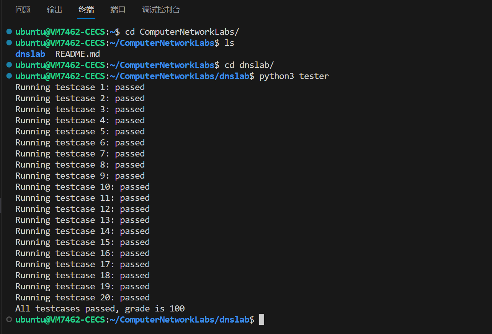
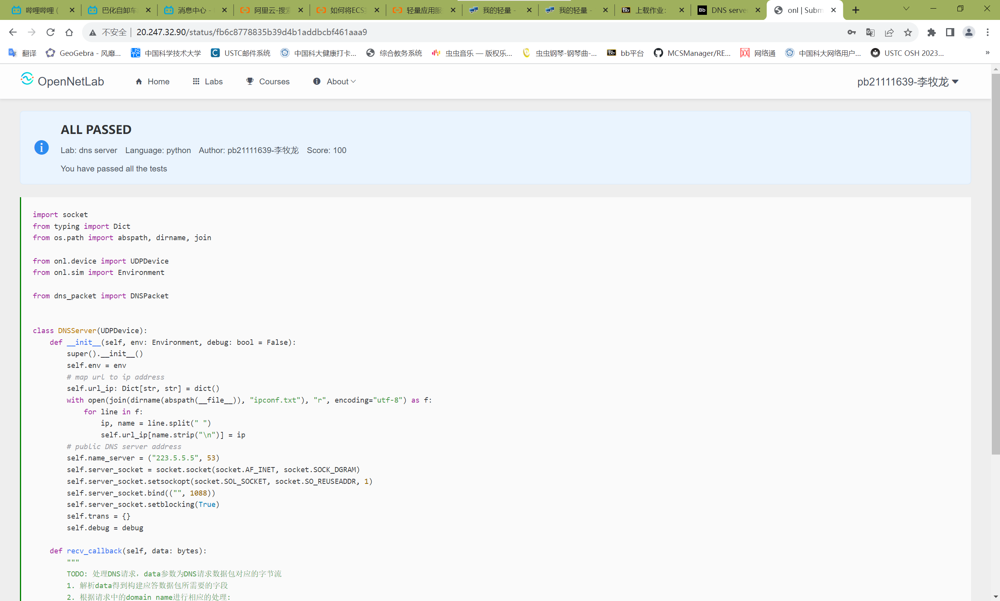

# DNS实验报告
## TODO部分补充的代码
```python
packet = DNSPacket(data)
    if packet.QR == 0 and packet.OPCODE == 0:
        if packet.name in self.url_ip:
            ip = self.url_ip[packet.name]
            intercepted = ip == "0.0.0.0"
            res = packet.generate_response(ip, intercepted)
        else:
            res = DNSPacket.generate_request(packet.name)
            self.server_socket.sendto(res, self.name_server)
            res = self.server_socket.recv(1024)
    self.send(res)
```
## 对补充代码的解释
- 根据助教给出的伪代码，首先需要处理接收到的数据，并检查是否是一个query。这里直接调用现成的DNSPacket对data进行解析，若`packet.QR == 0 and packet.OPCODE == 0`，则是一个query。
- 然后需要根据请求的域名进行处理。若域名在本地的url_ip字典中，则根据ip地址是否为`0.0.0.0`，决定拦截该域名/返回对应的IP地址。这里采用了一种简化的方式，让`intercepted`变量表示ip是否等于`0.0.0.0`，并将其作为参数传入`packet.generate_response`函数中，生成对应的response。
- 否则若域名不在本地的url_ip字典中，则需要向远程的DNS服务器发送请求，获取对应的IP地址。这里同样调用现成的`DNSPacket`中的`generate_request`方法，生成对应的request，然后发送给远程的DNS服务器，接收到response后，直接将收到的应答结果返回给客户端。
## 对未通过的远程测试用例的解释
全都过了

## tester程序在本地执行的输出结果


## 代码在OpenNetLab上的最终评估结果
