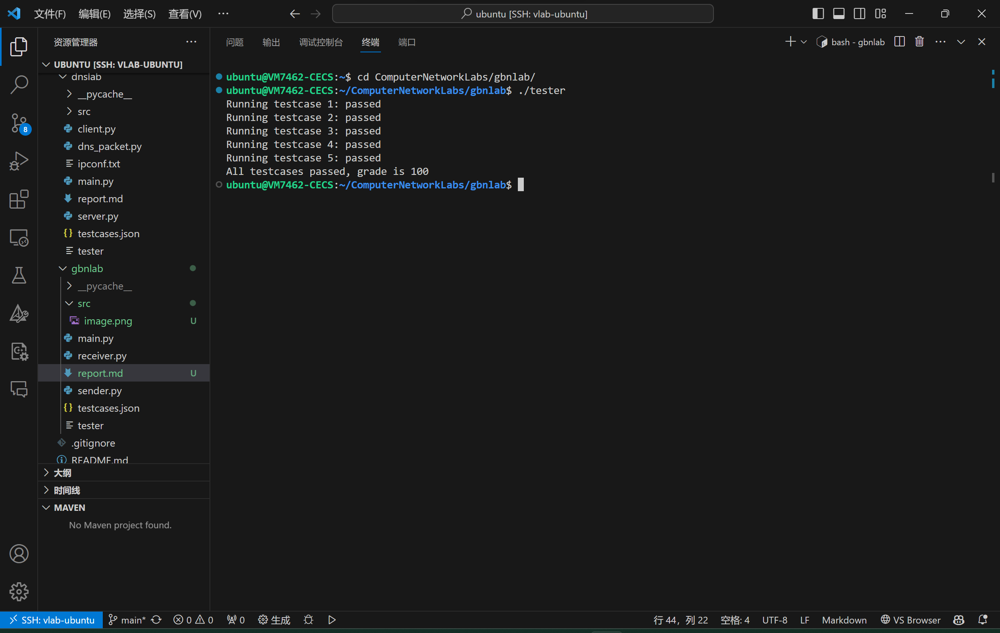
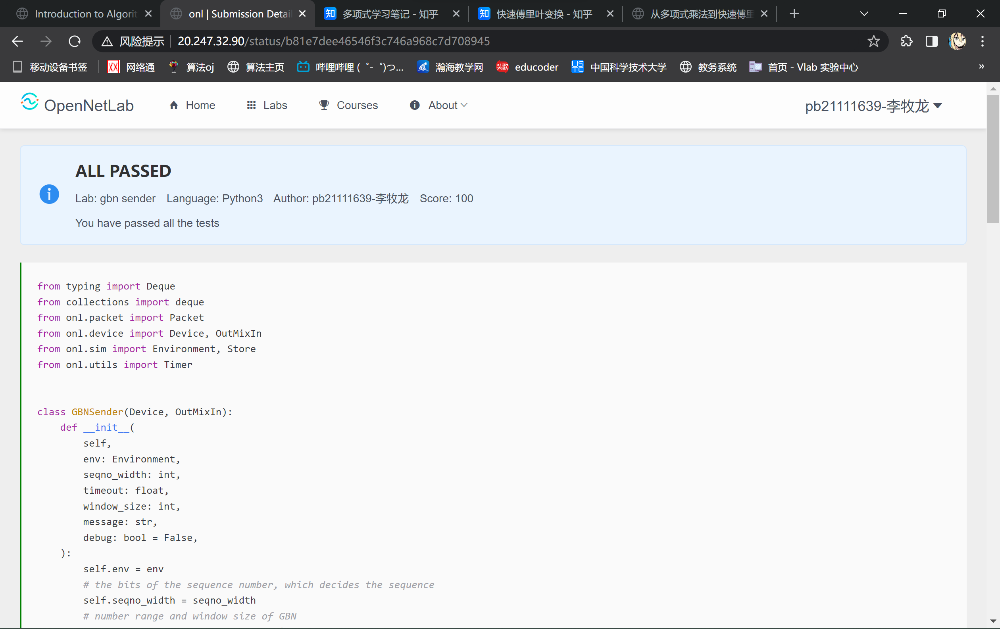

# GBN实验报告
## TODO部分补充的代码及解释
### 1. run()函数
```python
while ((self.seqno - self.seqno_start + self.seqno_range) % self.seqno_range) < self.window_size and self.absno < len(self.message):
    pck = self.new_packet(self.seqno, self.message[self.absno])
    self.send_packet(pck)
    self.outbound.append(pck)
    self.seqno = (self.seqno + 1) % self.seqno_range
    self.absno += 1
self.timer.restart(self.timeout)
```
这里while循环进行两个判断，如果窗口没满且还有数据没发送，则继续发送数据。发送数据后，更新seqno，absno，将发送的数据包存入缓存。最后重启计时器。由于序号有范围限制，因此要在适当的地方取模。
### 2. put()函数
```python
if (self.seqno_start < self.seqno and ackno >= self.seqno_start and ackno < self.seqno) or (self.seqno_start > self.seqno and (ackno >= self.seqno_start or ackno < self.seqno)):
    self.seqno_start = ackno + 1
    self.seqno_start %= self.seqno_range
    popnum = (ackno - self.outbound[0].packet_id + 1 + self.seqno_range) % self.seqno_range
    for i in range(popnum):
        self.outbound.popleft()
while ((self.seqno - self.seqno_start + self.seqno_range) % self.seqno_range) < self.window_size and self.absno < len(self.message):
    pck = self.new_packet(self.seqno, self.message[self.absno])
    self.send_packet(pck)
    self.outbound.append(pck)
    self.seqno = (self.seqno + 1) % self.seqno_range
    self.absno += 1
self.timer.restart(self.timeout)
if self.absno == len(self.message) and len(self.outbound) == 0:
    self.finish_channel.put(True)
```
首先，判断收到的ack序号是否在窗口内。由于序号是循环使用的，因此判断是否在窗口内需要分为两种情况，一种是seqno_start < seqno，另一种是seqno_start > seqno。
如果序号在窗口内，则更新seqno_start，将缓存中已被确认的数据包弹出。然后，如果窗口没满且还有数据没发送，则继续发送数据，并重启计时器。如果所有数据都已经发送完毕，且所有数据包都已被确认（缓存为空），那么通过`self.finish_channel.put(True)`终止发送。
### 3. timeout_callback()函数
```python
for pck in self.outbound:
    self.send_packet(pck)
```
这个函数非常简单，将缓存中的所有数据包重新发送一遍即可。

## 对未通过的远程测试用例的解释
全部通过了。

## tester程序在本地执行的输出结果


## 代码在OpenNetLab上的最终评估结果
